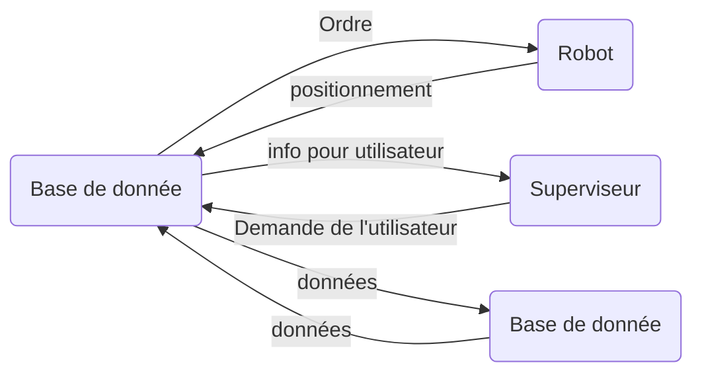
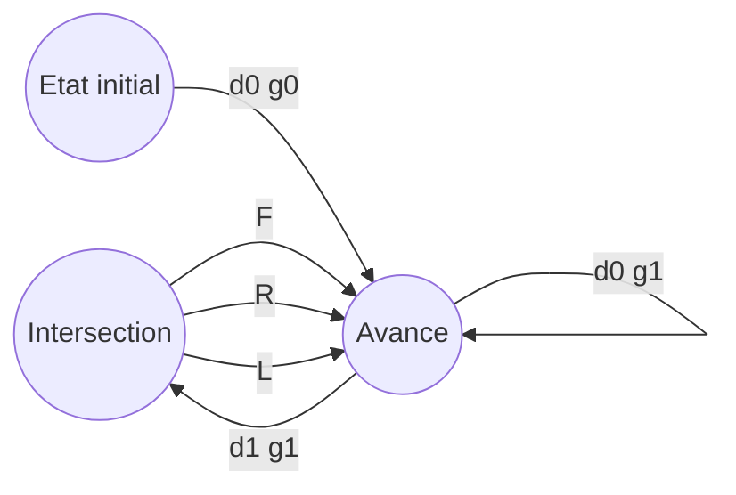

# IMERISoin

###### team3

Afin d'aider les hôpitaux aujourd'hui chargés, nous avons été tâchés de créer des robots distributeur de médicaments qui
iront à une chambre apporter des médicaments et qui repartiront à la pharmacie d'où ils sont partis. Ils seront
contrôlés grâce à un site qui connaîtra leur position et qui les empêchera de se rentrer dedans. De plus, les robots
auront des chemins prédéfinis pour chaque chambre et suivront des lignes sur le sol. Une base de donnée sera mise en
place afin de stocker des informations sur les robots, les patients et les médicaments. Tous les échanges entre **
l'interface**, **le superviseur**, **les robots** et **la base de données** sera fait grâce au **serveur**.

---

# SCRUM

## Rôles

Laurent CROUZIL ~ Scrum master 
Clovis CORDE ~ Web Service 
Alexis DEVleeschauwer ~ Java 
Omaima MADMOURH ~ Robot/arduino
Marc RICHARD ~ Robot/arduino

## Planning

Lundi 29/03 --> Sélection des rôles, détermination des tâches, organisation du planning. Mardi 30/03 --> Début du Java,
début du Web, suivit de ligne robot. Mercredi 31/03 --> Communication Java / Web, machine à état robot. Jeudi 01/04 -->
Finalisation robot, communication robot / Web. Vendredi 02/04 --> Premier prototype. WEEKEND

## Projet

Le projet consistera à créer:

### Un superviseur

L'interface Homme-Machine codée en java qui permettra de connaitre les infos des robots, de récupérer les demandes des
utilisateurs, et de renvoyer à l'utilisateur toutes les infos.

### Un ou plusieurs robots

Leur rôle sera de se déplacer selon un chemin prédéfini pour atteindre la chambre que l'utilisateur veut qu'ils
atteignent afin qu'ils puissent délivrer les médicaments et ensuite de retourner à la pharmacie ( 4 chambres, 3 fois par
jour par chambre).

### Une base de donnée

Permettra de stocker les données des patients, des robots et des médicaments.

### Un serveur web

Servira d'intermédiaire entre toutes les parties du projet. Il récupéra les demandes des utilisateurs du superviseur
afin d'envoyer la requête aux robots, d'envoyer les données à stocker à la base de donnée et de renvoyer les infos de
déplacement des robots au superviseur.

# LE ROBOT

Le robot sera contrôlé à **distance** et travaillera en **autonomie**. En effet il reçoit juste l'information de la
chambre à aller alimenter en médicaments et il effectuera le trajet seul. Il est composé de 2 capteurs de lumière qui
lui permettront de suivre le chemin, d'un capteur à ultrason afin de détecter les obstacles, de 3 roues et de 2 moteurs.

### Machine à état

Une **machine à état** est utilisée pour gérer les différents évènements que le robot pourra rencontrer, cela lui
permettra d'arriver à suivre une ligne droite, de tourner à gauche ou à droite à une intersection et de suivre un chemin
prédéterminé. Elle sera composée de 3 différents états et pourra switcher entre eux grâce aux informations obtenues par
les différents capteurs.

////TODO

### Fonctions

Pour chaque état de la machine à état, une fonction est appelée qui effectuera une action. Cette action est simple comme
tourner à gauche ou à droite ou même avancer tout droit. La complexité du programme vient des changements d'états qui se
font en fonction des différents capteurs ou du chemin que le robot est demandé de suivre. De plus, le robot envoie sa
position à chaque intersection au serveur qui va lui envoyer l'odre soit de poursuivre soit d'attendre.

# WEB

### URIs

Des fonctions ont été créées pour chaque URI donné. Le rôle du Service Web est de permettre la communication entre les différents pôles et cela est rendu possible avec les nombreux URIs donnés. Certains URIs permettent la communication avec la base de donné, et d'autres avec le superviseur ou encore le robot. Le Service Web n'envoie pas directement les infos aux différents pôles mais répond à des requêtes et il reçoit toutes les données que les autres pôles lui envoie.
### MUCHE

# JAVA

### Interface

Le rôle du superviseur est de permettre à l'utilisateur de lire les infos et d'envoyer les requêtes aux robots. Pour cela, une interface a été mise en place en Java. Elle permet de dialoguer avec le service Web de façon simple pour envoyer les requêtes soit au robot soit à la base de donnée.
### MUCHE
